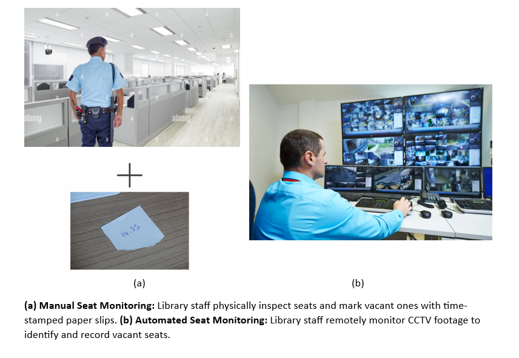
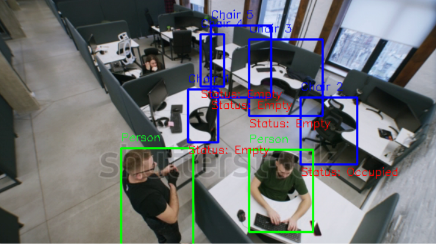

<div align="center">
<h2>
    SmartSeatGuard: Office Seat Occupancy Detection 
</h2>
<div>
    
</div>

</div>


## 🌟 Project Description

With using  YOLOv5 on video cameras detecting the occupancy time (with belongings, without human) of the seats in the office



Detailed explanation about the project is in this document:
[Document](https://docs.google.com/document/d/1pJ2VXuCuY54If5JJqTePYmlqCHkCWHwM6suYYAaN2k4/edit?usp=sharing)

# 🛠️ System Architecture


## 📜 Installation

```bash
git clone https://github.com/asumansaree/Library-Seat-Occupancy-Detection
cd Library-Seat-Occupancy-Detection
pip install -r requirements.txt
```

## 🤗 Usage

```bash
python seatDetect.py \
```

## 🚀 Sample Output

Output file will be displayed in the .mp4 format (with lower fps) 
For demonstration purposes in pdf document, it is included as image - 


<br clear="left"/>


## 🙏 References

* https://github.com/RizwanMunawar/yolov7-object-tracking
* Redmon J, Divvala S, Girshick R and Farhadi A You Only Look Once: Unified, Real-Time Object 
  Detection 2016IEEE Conference on Computer Vision and Pattern Recognition (Las Vegas) pp 779-788 
* COCO 2017 dataset: http://cocodataset.org
