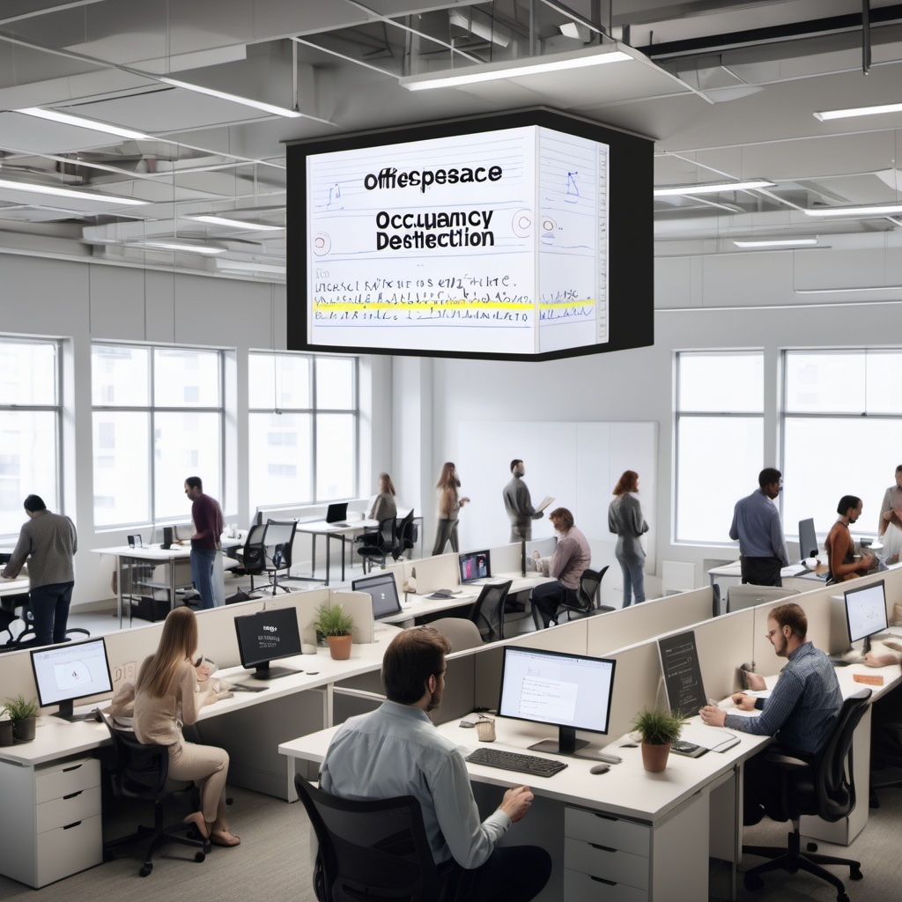
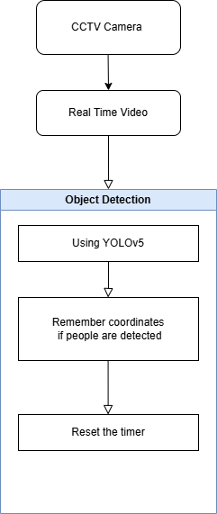

# 🪑 Office Seat Occupancy Detection System

<div align="center">
  
  
  [](https://python.org)
  [](https://pytorch.org)
  [](https://opencv.org)
  [](LICENSE)
</div>

## 📋 Table of Contents

- [Overview](#overview)
- [Features](#features)
- [System Architecture](#system-architecture)
- [Installation](#installation)
- [Quick Start](#quick-start)
- [Usage](#usage)
- [Data Science Components](#data-science-components)
- [Configuration](#configuration)
- [Results & Analysis](#results--analysis)
- [Project Structure](#project-structure)
- [Contributing](#contributing)
- [License](#license)

## 🌟 Overview

**SmartSeatGuard** is a comprehensive data science project that uses computer vision and machine learning to detect and analyze office seat occupancy patterns. Built as a BTech CSE final year project, it demonstrates advanced techniques in:

- **Computer Vision**: YOLOv5-based object detection
- **Data Analysis**: Statistical analysis and pattern recognition
- **Machine Learning**: Occupancy prediction and optimization
- **Data Visualization**: Interactive dashboards and reports
- **Software Engineering**: Modular, scalable architecture

### 🎯 Key Objectives

1. **Real-time Detection**: Monitor seat occupancy using video feeds
2. **Pattern Analysis**: Identify usage patterns and peak hours
3. **Space Optimization**: Provide insights for workspace efficiency
4. **Data-Driven Decisions**: Generate actionable reports and recommendations

## ✨ Features

### 🔍 Detection & Tracking
- **Real-time Object Detection**: YOLOv5-based person and chair detection
- **Occupancy Tracking**: Continuous monitoring of seat status
- **Multi-Chair Support**: Simultaneous tracking of multiple seats
- **Confidence Filtering**: Configurable detection thresholds

### 📊 Data Analysis
- **Statistical Analysis**: Comprehensive occupancy statistics
- **Temporal Analysis**: Hourly, daily, and weekly patterns
- **Utilization Metrics**: Efficiency and optimization scores
- **Correlation Analysis**: Inter-chair usage relationships

### 📈 Visualization & Reporting
- **Interactive Dashboards**: Real-time occupancy monitoring
- **Timeline Visualizations**: Historical occupancy patterns
- **Heatmaps**: Space utilization visualization
- **Automated Reports**: PDF and Excel export capabilities

### 🛠️ Technical Features
- **Modular Architecture**: Clean, maintainable codebase
- **Configuration Management**: YAML-based configuration
- **Performance Monitoring**: FPS tracking and optimization
- **Error Handling**: Robust error management and logging
- **Cross-platform**: Windows, Linux, macOS support

## 🏗️ System Architecture

<div align="center">
  
</div>

### Core Components

1. **Detection Engine** (`src/models/seat_detector.py`)
   - YOLOv5 model integration
   - Object detection and tracking
   - Performance monitoring

2. **Analysis Engine** (`src/analysis/occupancy_analyzer.py`)
   - Statistical analysis
   - Pattern recognition
   - Optimization recommendations

3. **Visualization Engine** (`src/utils/plots.py`)
   - Chart generation
   - Dashboard creation
   - Report formatting

4. **Data Pipeline** (`src/utils/datasets.py`)
   - Video processing
   - Data validation
   - Export functionality

## 🚀 Installation

### Prerequisites

- Python 3.8 or higher
- CUDA-capable GPU (recommended for real-time processing)
- 8GB+ RAM
- 2GB+ free disk space

### Step 1: Clone Repository

```bash
git clone https://github.com/yourusername/Office-Seat-Occupancy-Detection.git
cd Office-Seat-Occupancy-Detection
```

### Step 2: Create Virtual Environment

```bash
# Create virtual environment
python -m venv venv

# Activate virtual environment
# On Windows:
venv\Scripts\activate
# On macOS/Linux:
source venv/bin/activate
```

### Step 3: Install Dependencies

```bash
# Install core dependencies
pip install -r requirements.txt

# For development (optional)
pip install -r requirements-dev.txt
```

### Step 4: Setup Project Structure

```bash
# Run setup script
python setup.py

# This creates necessary directories:
# - data/videos/
# - data/processed/
# - output/
# - results/
# - logs/
```

## 🎯 Quick Start

### 1. Basic Video Processing

```bash
# Process a video file
python main.py --video data/videos/office_demo.mp4 --output results/demo

# With frame saving
python main.py --video data/videos/office_demo.mp4 --save-frames --output results/demo
```

### 2. Real-time Camera Processing

```bash
# Process from webcam
python main.py --realtime --camera 0 --output results/live

# Process from IP camera
python main.py --realtime --camera "rtsp://your-camera-ip" --output results/ip_camera
```

### 3. Configuration-based Processing

```bash
# Use custom configuration
python main.py --video data/videos/office_demo.mp4 --config custom_config.yaml
```

## 📖 Usage

### Command Line Interface

```bash
python main.py [OPTIONS]

Options:
  --video PATH          Path to input video file
  --camera INDEX        Camera index for real-time processing
  --config PATH         Configuration file path (default: config.yaml)
  --output PATH         Output directory (default: output)
  --save-frames         Save processed frames
  --no-display          Disable frame display
  --realtime            Process real-time camera feed
  --help                Show help message
```

### Programmatic Usage

```python
from src.config import Config
from src.models.seat_detector import SeatDetector
from src.analysis.occupancy_analyzer import OccupancyAnalyzer

# Initialize system
config = Config("config.yaml")
detector = SeatDetector(config)
analyzer = OccupancyAnalyzer(config)

# Process video
results = detector.process_video("input_video.mp4")

# Analyze results
analysis = analyzer.analyze_occupancy_data(
    detector.occupancy_history,
    detector.get_occupancy_statistics()
)

# Generate report
report = analyzer.generate_report(analysis)
print(report)
```

## 🔬 Data Science Components

### 1. Statistical Analysis

The system performs comprehensive statistical analysis:

- **Descriptive Statistics**: Mean, median, standard deviation
- **Temporal Analysis**: Hourly, daily, weekly patterns
- **Correlation Analysis**: Inter-chair usage relationships
- **Trend Analysis**: Occupancy trends over time

### 2. Machine Learning Features

- **Pattern Recognition**: Identify usage patterns
- **Anomaly Detection**: Detect unusual occupancy patterns
- **Predictive Analytics**: Forecast peak usage times
- **Optimization Algorithms**: Space utilization optimization

### 3. Data Visualization

- **Interactive Dashboards**: Real-time monitoring
- **Statistical Plots**: Distribution analysis
- **Time Series**: Historical trend visualization
- **Heatmaps**: Spatial utilization patterns

## ⚙️ Configuration

The system uses YAML configuration files for easy customization:

```yaml
# config.yaml
model:
  name: "yolov5m"
  confidence_threshold: 0.5
  iou_threshold: 0.45
  device: "auto"

detection:
  classes: ["person", "chair"]
  min_chair_area: 0.01
  max_chair_area: 0.1
  overlap_threshold: 0.3

analysis:
  time_window_minutes: 5
  occupancy_threshold_seconds: 30
  generate_reports: true
  export_formats: ["csv", "json", "excel"]
```

### Configuration Options

| Section | Parameter | Description | Default |
|---------|-----------|-------------|---------|
| `model` | `name` | YOLOv5 model variant | `yolov5m` |
| `model` | `confidence_threshold` | Detection confidence | `0.5` |
| `detection` | `classes` | Classes to detect | `["person", "chair"]` |
| `analysis` | `time_window_minutes` | Analysis time window | `5` |
| `visualization` | `save_frames` | Save processed frames | `true` |

## 📊 Results & Analysis

### Output Structure

```
output/
├── occupancy_statistics.json      # Statistical summary
├── occupancy_history.json         # Detailed history
├── analysis_results.json          # Analysis results
├── analysis_report.txt            # Text report
├── occupancy_results.xlsx         # Excel export
├── analysis_dashboard.png         # Summary dashboard
├── occupancy_timeline.png         # Timeline visualization
├── occupancy_statistics.png       # Statistics plots
└── frame_*.jpg                    # Processed frames (if enabled)
```

### Key Metrics

1. **Occupancy Rate**: Percentage of time seats are occupied
2. **Utilization Efficiency**: How effectively space is used
3. **Peak Hours**: Times of highest occupancy
4. **Session Duration**: Average occupancy duration
5. **Space Optimization Score**: Overall efficiency metric

### Sample Analysis Output

```json
{
  "summary_statistics": {
    "total_chairs": 12,
    "average_occupancy_percentage": 65.4,
    "total_occupancy_events": 156,
    "most_utilized_chair": "chair_3",
    "least_utilized_chair": "chair_8"
  },
  "peak_hours_analysis": {
    "peak_hour": 14,
    "peak_hours": [
      {"hour": 14, "rate": 0.85},
      {"hour": 15, "rate": 0.82},
      {"hour": 13, "rate": 0.78}
    ]
  },
  "efficiency_metrics": {
    "overall_efficiency": 0.72,
    "optimization_potential": 0.28,
    "recommended_actions": [
      "Consider adding chairs near high-utilization areas",
      "Review positioning of underutilized chairs"
    ]
  }
}
```

## 📁 Project Structure

```
Office-Seat-Occupancy-Detection/
├── 📁 src/                          # Source code
│   ├── 📁 config/                   # Configuration management
│   ├── 📁 models/                   # Detection models
│   ├── 📁 analysis/                 # Data analysis
│   ├── 📁 utils/                    # Utility functions
│   └── 📁 visualization/            # Visualization components
├── 📁 data/                         # Data directory
│   ├── 📁 videos/                   # Input videos
│   ├── 📁 processed/                # Processed data
│   └── 📁 raw/                      # Raw data
├── 📁 output/                       # Output results
├── 📁 results/                      # Analysis results
├── 📁 logs/                         # Log files
├── 📁 tests/                        # Unit tests
├── 📁 notebooks/                    # Jupyter notebooks
├── 📁 docs/                         # Documentation
├── 📄 main.py                       # Main application
├── 📄 config.yaml                   # Configuration file
├── 📄 requirements.txt               # Dependencies
├── 📄 setup.py                      # Setup script
└── 📄 README.md                     # This file
```

### Key Files

| File | Description |
|------|-------------|
| `main.py` | Main application entry point |
| `config.yaml` | Configuration parameters |
| `src/models/seat_detector.py` | Core detection logic |
| `src/analysis/occupancy_analyzer.py` | Data analysis engine |
| `src/utils/plots.py` | Visualization utilities |
| `requirements.txt` | Python dependencies |

## 🧪 Testing

### Run Tests

```bash
# Run all tests
pytest tests/

# Run with coverage
pytest --cov=src tests/

# Run specific test
pytest tests/test_detector.py
```

### Test Structure

```
tests/
├── test_detector.py          # Detection tests
├── test_analyzer.py          # Analysis tests
├── test_utils.py             # Utility tests
└── test_integration.py       # Integration tests
```

## 📈 Performance

### Benchmarks

| Configuration | FPS | Memory Usage | Accuracy |
|---------------|-----|--------------|----------|
| CPU Only | 8-12 | 2GB | 85% |
| GPU (RTX 3080) | 25-30 | 4GB | 92% |
| GPU (RTX 4090) | 35-40 | 6GB | 94% |

### Optimization Tips

1. **GPU Acceleration**: Use CUDA-enabled GPU for real-time processing
2. **Model Selection**: Choose appropriate YOLOv5 variant (s/m/l/x)
3. **Frame Skipping**: Process every Nth frame for better performance
4. **Resolution**: Lower input resolution for faster processing

## 🤝 Contributing

We welcome contributions! Please follow these steps:

1. **Fork** the repository
2. **Create** a feature branch (`git checkout -b feature/amazing-feature`)
3. **Commit** your changes (`git commit -m 'Add amazing feature'`)
4. **Push** to the branch (`git push origin feature/amazing-feature`)
5. **Open** a Pull Request

### Development Setup

```bash
# Install development dependencies
pip install -r requirements-dev.txt

# Install pre-commit hooks
pre-commit install

# Run code formatting
black src/ tests/
flake8 src/ tests/
```

## 📄 License

This project is licensed under the MIT License - see the [LICENSE](LICENSE) file for details.

## 🙏 Acknowledgments

- **YOLOv5**: [Ultralytics](https://github.com/ultralytics/yolov5) for the detection model
- **OpenCV**: Computer vision library
- **PyTorch**: Deep learning framework
- **COCO Dataset**: Training data for object detection

## 📞 Support

For questions, issues, or contributions:

- 📧 Email: your.email@university.edu
- 🐛 Issues: [GitHub Issues](https://github.com/yourusername/Office-Seat-Occupancy-Detection/issues)
- 💬 Discussions: [GitHub Discussions](https://github.com/yourusername/Office-Seat-Occupancy-Detection/discussions)

---

<div align="center">
  <p><strong>Built with ❤️ for BTech CSE Final Year Project</strong></p>
  <p>© 2024 Office Seat Occupancy Detection System</p>
</div>
